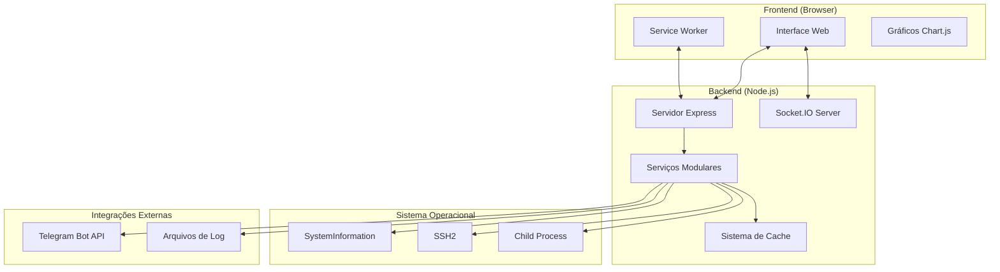
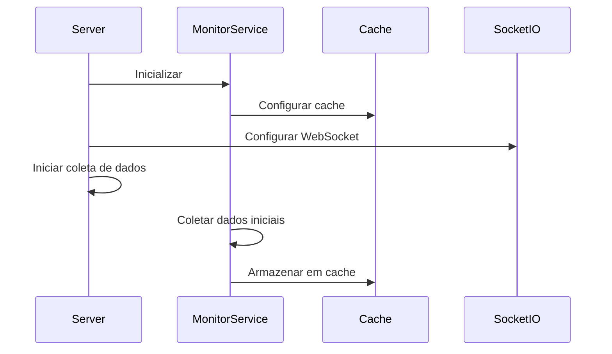
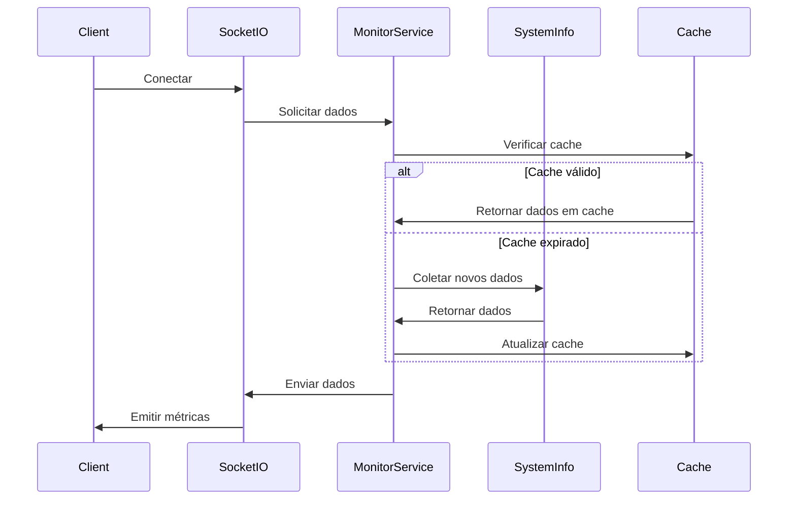
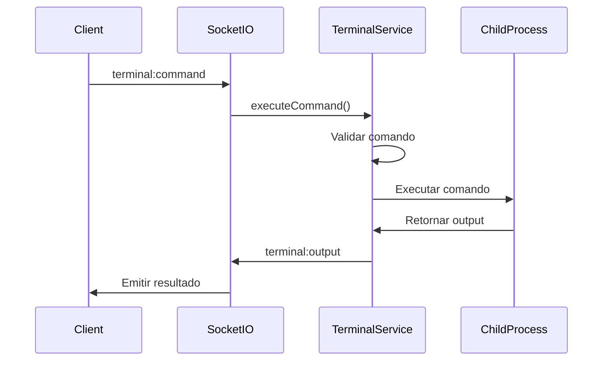

# 🏗️ Arquitetura do Sistema - SMX LiveBoard

Este documento descreve a arquitetura técnica do SMX LiveBoard, incluindo componentes, fluxo de dados e padrões de design utilizados.

## 📋 Índice

- [Visão Geral da Arquitetura](#visão-geral-da-arquitetura)
- [Componentes Principais](#componentes-principais)
- [Fluxo de Dados](#fluxo-de-dados)
- [Padrões de Design](#padrões-de-design)
- [Estrutura de Serviços](#estrutura-de-serviços)
- [Sistema de Cache](#sistema-de-cache)
- [Comunicação em Tempo Real](#comunicação-em-tempo-real)
- [Tratamento de Erros](#tratamento-de-erros)

## 🎯 Visão Geral da Arquitetura

O SMX LiveBoard segue uma arquitetura **modular e orientada a serviços**, com separação clara entre frontend e backend, utilizando comunicação em tempo real via WebSocket.



## 🧩 Componentes Principais

### 1. Servidor Principal (`backend/index.js`)

**Responsabilidades:**
- Inicialização do servidor Express
- Configuração do Socket.IO
- Orquestração dos serviços
- Middleware e rotas
- Gerenciamento de ciclo de vida

**Características:**
- **Singleton Pattern**: Uma única instância do servidor
- **Graceful Shutdown**: Encerramento controlado
- **Error Handling**: Tratamento global de erros
- **Adaptive Intervals**: Intervalos dinâmicos baseados em clientes conectados

### 2. Serviços Modulares

#### MonitorService (`backend/services/monitorService.js`)
```javascript
class MonitorService {
    // Coleta de dados do sistema
    async getSystemInfo()
    async getBasicSystemInfo()
    async getProcessesOnly(limit)
    
    // Sistema de cache inteligente
    getCacheStats()
    clearCache(type)
    
    // Métricas de performance
    getPerformanceStats()
    checkPerformanceAlerts()
}
```

**Responsabilidades:**
- Coleta de métricas do sistema (CPU, memória, disco, rede)
- Sistema de cache multi-camada
- Otimização de performance
- Detecção de alertas

#### ProcessMonitoringService (`backend/services/processMonitoringService.js`)
```javascript
class ProcessMonitoringService {
    // Monitoramento de processos
    async getTopProcesses(limit)
    async getProcessDetails(pid)
    
    // Histórico e estatísticas
    getProcessHistory()
    getProcessStats()
}
```

**Responsabilidades:**
- Monitoramento de processos em tempo real
- Histórico de processos
- Estatísticas de uso de recursos

#### TerminalService (`backend/services/terminalService.js`)
```javascript
class TerminalService {
    // Execução de comandos
    async executeCommand(command)
    isCommandSafe(command)
    
    // Sessões interativas
    createSession(sessionId)
    sendToSession(sessionId, command)
    closeSession(sessionId)
    
    // Autocompletar
    getCommandSuggestions(partial)
    getPathSuggestions(partial)
}
```

**Responsabilidades:**
- Execução segura de comandos
- Sessões de terminal interativas
- Sistema de autocompletar
- Validação de segurança

#### SSHService (`backend/services/sshService.js`)
```javascript
class SSHService {
    // Conexões SSH
    static async connect(config, socket)
    static async disconnect(connectionId)
    static async executeCommand(connectionId, command, socket)
    
    // Gerenciamento
    static getActiveConnections()
    static isConnectionActive(connectionId)
}
```

**Responsabilidades:**
- Conexões SSH seguras
- Execução de comandos remotos
- Gerenciamento de múltiplas conexões
- Streaming de output em tempo real

#### TelegramService (`backend/services/telegramService.js`)
```javascript
class TelegramService {
    // Configuração
    configure(botToken, chatId)
    isBotConfigured()
    
    // Envio de mensagens
    async sendMessage(message)
    async sendSystemAlert(type, data, severity)
    async sendStatusReport(data)
    
    // Testes
    async testConnection()
}
```

**Responsabilidades:**
- Integração com Telegram Bot API
- Envio de alertas e notificações
- Relatórios automáticos
- Configuração de bot

#### LogsService (`backend/services/logsService.js`)
```javascript
class LogsService {
    // Logging
    info(message, source, data)
    warning(message, source, data)
    error(message, source, data)
    critical(message, source, data)
    
    // Consulta
    getLogs(options)
    getLogStats()
    
    // Exportação
    async exportLogs(format, options)
    async clearOldLogs(daysToKeep)
}
```

**Responsabilidades:**
- Sistema de logging estruturado
- Consulta e filtragem de logs
- Exportação de dados
- Limpeza automática

### 3. Utilitários

#### Logger (`backend/utils/logger.js`)
```javascript
class Logger {
    // Métodos de log
    info(message, data)
    warning(message, data)
    error(message, data)
    critical(message, data)
    
    // Logs específicos
    startup(message, data)
    shutdown(message, data)
    websocket(message, data)
    performance(message, data)
}
```

**Responsabilidades:**
- Sistema de logging centralizado
- Formatação de logs
- Níveis de log configuráveis
- Logs estruturados com contexto

#### HttpLogger (`backend/utils/httpLogger.js`)
```javascript
class HttpLogger {
    // Middleware
    middleware()
    
    // Cache e limpeza
    startCacheCleanup()
    getCacheStats()
}
```

**Responsabilidades:**
- Logging de requisições HTTP
- Cache de logs para performance
- Limpeza automática de cache

## 🔄 Fluxo de Dados

### 1. Inicialização do Sistema



### 2. Coleta de Métricas



### 3. Execução de Comandos



## 🎨 Padrões de Design

### 1. Singleton Pattern
- **Servidor Principal**: Uma única instância
- **Logger**: Instância global compartilhada
- **Cache**: Sistema centralizado

### 2. Service Layer Pattern
- Separação clara de responsabilidades
- Serviços independentes e testáveis
- Interface consistente entre serviços

### 3. Observer Pattern
- **Socket.IO Events**: Clientes observam mudanças
- **LogsService**: Múltiplos listeners para logs
- **TerminalService**: Callbacks para output

### 4. Factory Pattern
- **SSHService**: Criação de conexões SSH
- **TerminalService**: Criação de sessões
- **Logger**: Criação de instâncias de log

### 5. Strategy Pattern
- **Cache**: Diferentes estratégias de TTL
- **LogsService**: Diferentes formatos de exportação
- **MonitorService**: Diferentes métodos de coleta

## 🗂️ Estrutura de Serviços

### Hierarquia de Dependências

```
SMXLiveBoardServer
├── MonitorService (essencial)
├── ProcessMonitoringService
├── TerminalService
├── LogsService
├── TelegramService
└── SSHService (estático)
```

### Inicialização Assíncrona

```javascript
// Serviços essenciais (síncronos)
this.monitorService = new MonitorService();

// Serviços secundários (assíncronos)
await Promise.all([
    this.initializeProcessMonitoring(),
    this.initializeTerminalService(),
    this.initializeLogsService(),
    this.initializeTelegramService()
]);
```

## 💾 Sistema de Cache

### Estrutura Multi-Camada

```javascript
this.cache = {
    // Cache rápido (30s)
    basicInfo: { data, timestamp, ttl: 30000 },
    
    // Cache completo (15s)
    fullInfo: { data, timestamp, ttl: 15000 },
    
    // Cache estático (5min)
    staticInfo: { data, timestamp, ttl: 300000 },
    
    // Cache de sistema (1min)
    systemInfo: { data, timestamp, ttl: 60000 },
    
    // Cache de rede (30s)
    networkInfo: { data, timestamp, ttl: 30000 },
    
    // Cache de processos (10s)
    processesInfo: { data, timestamp, ttl: 10000 }
};
```

### Estratégias de Cache

1. **Cache por TTL**: Dados expiram automaticamente
2. **Cache por Invalidação**: Limpeza manual quando necessário
3. **Cache Adaptativo**: TTL ajustado baseado na frequência de acesso
4. **Cache Hierárquico**: Diferentes níveis de cache para diferentes tipos de dados

## 🔌 Comunicação em Tempo Real

### WebSocket Events

#### Cliente → Servidor
```javascript
// Dados iniciais
socket.emit('request_initial_data')
socket.emit('request_current_metrics')
socket.emit('request_current_processes')

// Terminal
socket.emit('terminal:create', data)
socket.emit('terminal:command', { command, sessionId })
socket.emit('terminal:autocomplete', { partialCommand, type })

// Logs
socket.emit('logs:request', options)
socket.emit('logs:start_realtime')

// SSH
socket.emit('ssh-connect', connectionData)
socket.emit('ssh-command', { command, connection })
socket.emit('ssh-disconnect', connectionData)

// Heartbeat
socket.emit('heartbeat', { timestamp })
```

#### Servidor → Cliente
```javascript
// Dados do sistema
socket.emit('initial:data', systemData)
socket.emit('system:metrics', metrics)
socket.emit('processes:update', processes)

// Terminal
socket.emit('terminal:created', { sessionId })
socket.emit('terminal:output', { output, sessionId })
socket.emit('terminal:error', { error, sessionId })
socket.emit('terminal:suggestions', { suggestions })

// Logs
socket.emit('logs:data', logsData)
socket.emit('logs:stats', stats)
socket.emit('logs:realtime_started')

// SSH
socket.emit('ssh-connection-status', status)
socket.emit('ssh-output', { output, connectionId })
socket.emit('ssh-error', { error })

// Sistema
socket.emit('heartbeat_ack', { timestamp })
socket.emit('health_check', { timestamp })
```

### Configurações de Conexão

```javascript
const socketIOConfig = {
    // Timeouts otimizados
    pingTimeout: 30000,
    pingInterval: 20000,
    upgradeTimeout: 10000,
    
    // Transportes
    transports: ['websocket', 'polling'],
    
    // Compressão
    perMessageDeflate: {
        threshold: 1024,
        concurrencyLimit: 10,
        memLevel: 7
    },
    
    // Buffer aumentado
    maxHttpBufferSize: 1e8, // 100MB
};
```

## ⚠️ Tratamento de Erros

### Estratégias de Tratamento

1. **Graceful Degradation**: Sistema continua funcionando mesmo com falhas parciais
2. **Circuit Breaker**: Previne cascata de falhas
3. **Retry Logic**: Tentativas automáticas com backoff
4. **Fallback Data**: Dados alternativos quando primários falham

### Níveis de Erro

```javascript
// Erros não críticos (serviços secundários)
try {
    await this.initializeTelegramService();
} catch (error) {
    logger.warn('TelegramService falhou, continuando sem notificações');
}

// Erros críticos (serviços essenciais)
try {
    this.monitorService = new MonitorService();
} catch (error) {
    logger.failure('MonitorService crítico falhou');
    process.exit(1);
}
```

### Logging de Erros

```javascript
logger.error('Erro ao coletar métricas', {
    error: error.message,
    stack: error.stack,
    type: 'metrics_collection',
    timestamp: new Date().toISOString()
});
```

## 🔧 Configurações de Performance

### Intervalos Adaptativos

```javascript
const adaptiveConfig = {
    baseMetricsInterval: 10000,    // 10s base
    baseProcessesInterval: 45000,  // 45s base
    minMetricsInterval: 8000,      // 8s mínimo
    maxMetricsInterval: 20000,     // 20s máximo
    minProcessesInterval: 30000,   // 30s mínimo
    maxProcessesInterval: 90000    // 90s máximo
};
```

### Otimizações

1. **Throttling**: Evita envios muito frequentes
2. **Batch Processing**: Agrupa operações similares
3. **Lazy Loading**: Carrega dados sob demanda
4. **Connection Pooling**: Reutiliza conexões SSH
5. **Memory Management**: Limpeza automática de recursos

---

Esta arquitetura garante **escalabilidade**, **manutenibilidade** e **performance** do sistema, permitindo fácil extensão e modificação de funcionalidades.
